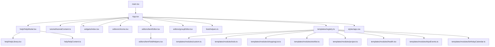
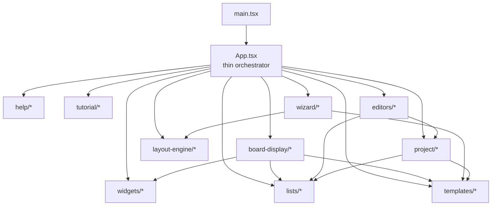

# Life Plan Lite Architecture

Last updated: 2026-05-08

This document gives a practical architecture view of the renderer and how the main modules currently fit together.

It is intentionally split into:
- `As-Is`: what the app looks like today
- `To-Be`: where we want the file/module boundaries to land next

## Principles

- One feature/workflow should have one clear home.
- Shared business rules should not be duplicated across board/admin paths.
- Template-specific behavior should live in template modules on top of a shared core.
- Business logic should stay portable enough for future web/mobile work.

## As-Is Overview



## What Is Already Extracted

### Help

- [help/HelpModal.tsx](</c:/LPL%20-%20Life%20Plan%20Lite/src/renderer/src/help/HelpModal.tsx>)
- [help/helpLibrary.tsx](</c:/LPL%20-%20Life%20Plan%20Lite/src/renderer/src/help/helpLibrary.tsx>)
- [help/helpContent.ts](</c:/LPL%20-%20Life%20Plan%20Lite/src/renderer/src/help/helpContent.ts>)

### Tutorial

- [tutorial/tutorialContent.ts](</c:/LPL%20-%20Life%20Plan%20Lite/src/renderer/src/tutorial/tutorialContent.ts>)

### Widgets

- [widgets/index.tsx](</c:/LPL%20-%20Life%20Plan%20Lite/src/renderer/src/widgets/index.tsx>)

This module now owns:
- widget metadata
- widget defaults
- widget sizing rules
- widget rendering
- weather widget behavior

### Editors

- [editors/chrome.tsx](</c:/LPL%20-%20Life%20Plan%20Lite/src/renderer/src/editors/chrome.tsx>)
- [editors/itemEditor.tsx](</c:/LPL%20-%20Life%20Plan%20Lite/src/renderer/src/editors/itemEditor.tsx>)
- [editors/itemFieldHelpers.tsx](</c:/LPL%20-%20Life%20Plan%20Lite/src/renderer/src/editors/itemFieldHelpers.tsx>)
- [editors/groupEditor.tsx](</c:/LPL%20-%20Life%20Plan%20Lite/src/renderer/src/editors/groupEditor.tsx>)

These are shared behavior paths used by both board/admin entry points.

### Shared List Helpers

- [lists/helpers.ts](</c:/LPL%20-%20Life%20Plan%20Lite/src/renderer/src/lists/helpers.ts>)

This module now owns:
- visible/editable field selection
- item title resolution
- date parsing helpers
- choice config helpers
- shared blank/editable value defaults

### Template Registry

- [templates/registry.ts](</c:/LPL%20-%20Life%20Plan%20Lite/src/renderer/src/templates/registry.ts>)
- [templates/types.ts](</c:/LPL%20-%20Life%20Plan%20Lite/src/renderer/src/templates/types.ts>)
- [templates/modules](</c:/LPL%20-%20Life%20Plan%20Lite/src/renderer/src/templates/modules>)

This layer currently handles:
- template-specific board columns
- template-specific board rendering overrides
- early specialized behavior for Health / Wishlist / Project / Birthday Calendar

## What Still Lives In `App.tsx`

`App.tsx` is still the main coordination file, but several major workflows now run through extracted modules even if some legacy copies/helpers remain inline.

### 1. App orchestration

- route state
- current board/list/group/item/widget selection
- modal orchestration
- action wiring and mutation orchestration

### 2. Wizard

Active module:
- [src/renderer/src/wizard/index.tsx](</c:/LPL%20-%20Life%20Plan%20Lite/src/renderer/src/wizard/index.tsx>)

`App.tsx` still contains:
- legacy inline wizard code pending cleanup

### 3. List editor

Active modules:
- [src/renderer/src/list-editor/index.tsx](</c:/LPL%20-%20Life%20Plan%20Lite/src/renderer/src/list-editor/index.tsx>)
- [src/renderer/src/list-editor](</c:/LPL%20-%20Life%20Plan%20Lite/src/renderer/src/list-editor>)

### 4. Board display

Active module:
- [src/renderer/src/board-display/index.tsx](</c:/LPL%20-%20Life%20Plan%20Lite/src/renderer/src/board-display/index.tsx>)

`App.tsx` still contains:
- board display column assembly
- some board sorting/presentation helpers
- legacy inline display code pending cleanup

### 5. Layout engine

Active module:
- [src/renderer/src/layout-engine/index.ts](</c:/LPL%20-%20Life%20Plan%20Lite/src/renderer/src/layout-engine/index.ts>)

`App.tsx` still contains:
- older inline copies of some layout helpers pending cleanup

### 6. Project rules/helpers

Active module:
- [src/renderer/src/project/index.tsx](</c:/LPL%20-%20Life%20Plan%20Lite/src/renderer/src/project/index.tsx>)

`App.tsx` still contains:
- remaining project/gantt helpers used by board presentation
- older inline copies pending cleanup

## Current Hotspots In `App.tsx`

The biggest remaining seams are:

```text
buildBoardDisplayColumns
orderedBoardRenderFields
formatBoardDisplayValue
birthday/project display helpers
legacy inline wizard/layout/project copies
tutorial overlay + admin orchestration
orderedStructureFieldEntries
sortBoardDisplayRows      -> board-display/list-presentation modules
```

## To-Be Architecture



## Target Module Breakdown

### `wizard/`

Own:
- wizard steps
- wizard state machine
- wizard list/widget planning helpers
- wizard-first-run/reset flow

### `list-editor/`

Own:
- `ListEditorPanel`
- structure rows
- summary rows
- column draft model/helpers
- list settings tab logic

### `board-display/`

Own:
- `DisplayBoard`
- `BoardListView`
- board display row building
- board display column assembly
- board sorting logic

### `layout-engine/`

Own:
- list placement helpers
- widget placement helpers
- move/resize/swap/reflow logic

### `project/`

Own:
- project item-type helpers
- hierarchy helpers
- milestone logic
- parent/child date reconciliation
- gantt helpers

## Immediate Refactor Plan

Recommended next cleanup order:

1. remove legacy inline copies now superseded by extracted modules
2. move residual board-display sorting/presentation helpers beside `board-display/`
3. move remaining gantt/project presentation helpers beside `project/`
4. isolate tutorial/admin orchestration helpers
5. add tests around layout and project-aware mutations

That order gives a good balance of:
- line-count reduction
- clearer responsibility ownership
- low risk of reintroducing duplicate live behavior

## Current Status Snapshot

- Active renderer modules now exist for `list-editor`, `widget-editor`, `board-display`, `layout-engine`, `project`, and `wizard`.
- `App.tsx` is still the main orchestrator and still contains some duplicated legacy logic that should be deleted once the extracted seams are fully consolidated.
- `App.tsx` is materially smaller than the earlier monolithic state, but the cleanup pass is still important before calling the modularization complete.
