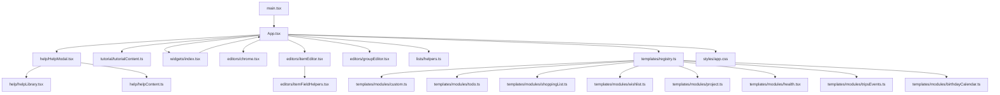
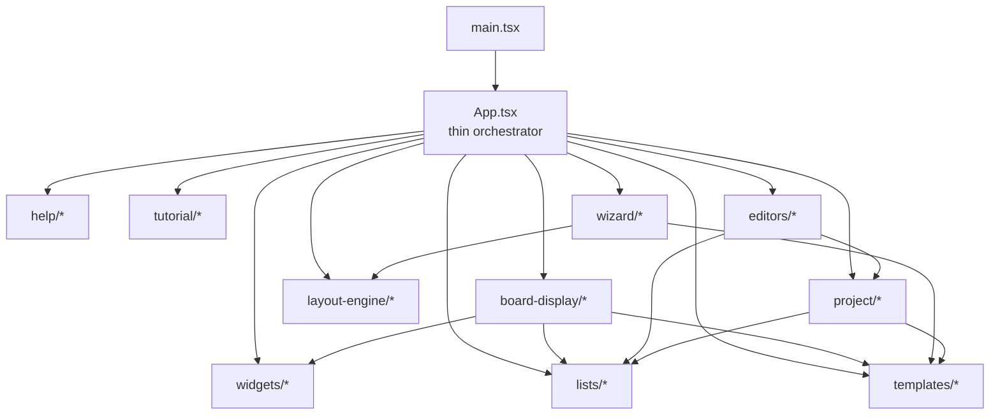

# Life Plan Lite Architecture

Last updated: 2026-05-08

This document gives a practical architecture view of the renderer and how the main modules currently fit together.

It is intentionally split into:
- `As-Is`: what the app looks like today
- `To-Be`: where we want the file/module boundaries to land next

## Principles

- One feature/workflow should have one clear home.
- Shared business rules should not be duplicated across board/admin paths.
- Template-specific behavior should live in template modules on top of a shared core.
- Business logic should stay portable enough for future web/mobile work.

## As-Is Overview



## What Is Already Extracted

### Help

- [help/HelpModal.tsx](</c:/LPL%20-%20Life%20Plan%20Lite/src/renderer/src/help/HelpModal.tsx>)
- [help/helpLibrary.tsx](</c:/LPL%20-%20Life%20Plan%20Lite/src/renderer/src/help/helpLibrary.tsx>)
- [help/helpContent.ts](</c:/LPL%20-%20Life%20Plan%20Lite/src/renderer/src/help/helpContent.ts>)

### Tutorial

- [tutorial/tutorialContent.ts](</c:/LPL%20-%20Life%20Plan%20Lite/src/renderer/src/tutorial/tutorialContent.ts>)

### Widgets

- [widgets/index.tsx](</c:/LPL%20-%20Life%20Plan%20Lite/src/renderer/src/widgets/index.tsx>)

This module now owns:
- widget metadata
- widget defaults
- widget sizing rules
- widget rendering
- weather widget behavior

### Editors

- [editors/chrome.tsx](</c:/LPL%20-%20Life%20Plan%20Lite/src/renderer/src/editors/chrome.tsx>)
- [editors/itemEditor.tsx](</c:/LPL%20-%20Life%20Plan%20Lite/src/renderer/src/editors/itemEditor.tsx>)
- [editors/itemFieldHelpers.tsx](</c:/LPL%20-%20Life%20Plan%20Lite/src/renderer/src/editors/itemFieldHelpers.tsx>)
- [editors/groupEditor.tsx](</c:/LPL%20-%20Life%20Plan%20Lite/src/renderer/src/editors/groupEditor.tsx>)

These are shared behavior paths used by both board/admin entry points.

### Shared List Helpers

- [lists/helpers.ts](</c:/LPL%20-%20Life%20Plan%20Lite/src/renderer/src/lists/helpers.ts>)

This module now owns:
- visible/editable field selection
- item title resolution
- date parsing helpers
- choice config helpers
- shared blank/editable value defaults

### Template Registry

- [templates/registry.ts](</c:/LPL%20-%20Life%20Plan%20Lite/src/renderer/src/templates/registry.ts>)
- [templates/types.ts](</c:/LPL%20-%20Life%20Plan%20Lite/src/renderer/src/templates/types.ts>)
- [templates/modules](</c:/LPL%20-%20Life%20Plan%20Lite/src/renderer/src/templates/modules>)

This layer currently handles:
- template-specific board columns
- template-specific board rendering overrides
- early specialized behavior for Health / Wishlist / Project / Birthday Calendar

## What Still Lives In `App.tsx`

`App.tsx` is still the main coordination file and currently still owns several large subsystems.

### 1. App orchestration

- route state
- current board/list/group/item/widget selection
- modal orchestration
- action wiring and mutation orchestration

### 2. Wizard

Still in:
- [App.tsx](</c:/LPL%20-%20Life%20Plan%20Lite/src/renderer/src/App.tsx>)

Main anchor:
- `ConfigurationWizard`

### 3. List editor

Still in:
- [App.tsx](</c:/LPL%20-%20Life%20Plan%20Lite/src/renderer/src/App.tsx>)

Main anchors:
- `ListEditorPanel`
- `SystemColumnRow`
- `ColumnRow`
- `ColumnSummaryRow`
- column draft helpers

### 4. Board display

Still in:
- [App.tsx](</c:/LPL%20-%20Life%20Plan%20Lite/src/renderer/src/App.tsx>)

Main anchors:
- `DisplayBoard`
- `BoardListView`
- board row building
- board display column assembly
- board sorting

### 5. Layout engine

Still in:
- [App.tsx](</c:/LPL%20-%20Life%20Plan%20Lite/src/renderer/src/App.tsx>)

Main responsibility:
- display placement/reflow/swap/move/resize logic for lists and widgets

### 6. Project rules/helpers

Still in:
- [App.tsx](</c:/LPL%20-%20Life%20Plan%20Lite/src/renderer/src/App.tsx>)

Main responsibility:
- project hierarchy logic
- project parent/child range reconciliation
- milestone dependency alignment
- gantt-related helpers

## Current Hotspots In `App.tsx`

The biggest remaining seams are:

```text
ConfigurationWizard       -> wizard module
ListEditorPanel           -> list-editor module
DisplayBoard              -> board-display module
BoardListView             -> board-display module
placeListForDisplay*      -> layout-engine module
normalizeWidgetDisplay*   -> layout-engine module
submitProjectAwareItemMutation
projectEditableFieldColumns
project* helpers          -> project module
buildBoardDisplayColumns
orderedStructureFieldEntries
sortBoardDisplayRows      -> board-display/list-presentation modules
```

## To-Be Architecture



## Target Module Breakdown

### `wizard/`

Own:
- wizard steps
- wizard state machine
- wizard list/widget planning helpers
- wizard-first-run/reset flow

### `list-editor/`

Own:
- `ListEditorPanel`
- structure rows
- summary rows
- column draft model/helpers
- list settings tab logic

### `board-display/`

Own:
- `DisplayBoard`
- `BoardListView`
- board display row building
- board display column assembly
- board sorting logic

### `layout-engine/`

Own:
- list placement helpers
- widget placement helpers
- move/resize/swap/reflow logic

### `project/`

Own:
- project item-type helpers
- hierarchy helpers
- milestone logic
- parent/child date reconciliation
- gantt helpers

## Immediate Refactor Plan

Recommended next extraction order:

1. `list-editor`
2. `board-display`
3. `layout-engine`
4. `project`
5. `wizard`

That order gives a good balance of:
- line-count reduction
- clearer responsibility ownership
- low risk of reintroducing duplicate live behavior

## Current Status Snapshot

- `App.tsx` is no longer the only home for help, tutorial, widgets, item editing, group editing, and shared list helpers.
- `App.tsx` is still the main orchestrator and still contains several large feature workflows.
- The codebase is meaningfully cleaner than before, but not yet at the final modular target.
